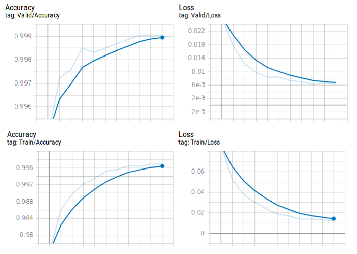
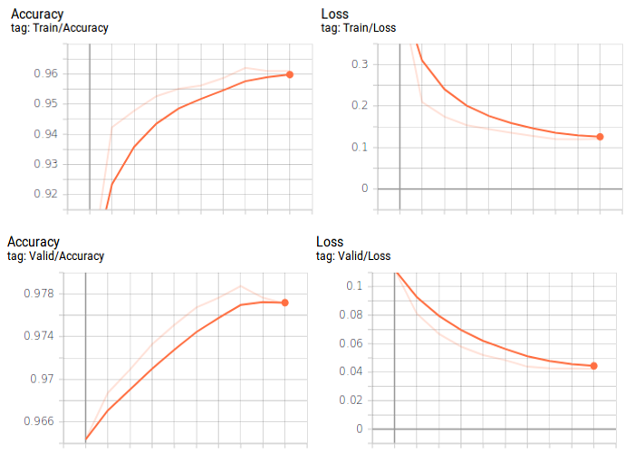
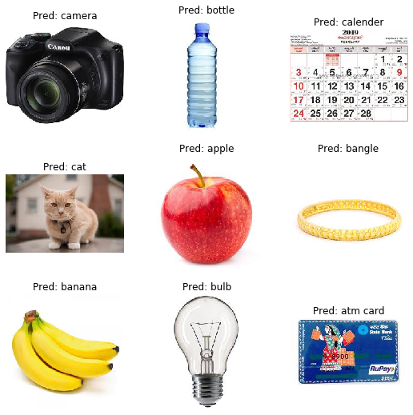

## Pytorch-Image-Classification

A simple demo of **image classification** using pytorch. Here, we use a **custom dataset** containing **43956 images** belonging to **11 classes** for training(and validation). Also, we compare three different approaches for training viz. **training from scratch, finetuning the convnet and convnet as a feature extractor**, with the help of **pretrained** pytorch models. The models used include: **VGG11, Resnet18 and MobilenetV2**.

### Dependencies

* Python3, Scikit-learn
* Pytorch, PIL
* Torchsummary, Tensorboard

```python
pip install torchsummary # keras-summary
pip install tensorboard  # tensoflow-logging
```

**NB**: Update the libraries to their latest versions before training.

### How to run

**Download** and extract training dataset: [imds_small](https://drive.google.com/file/d/1fPDnom5uGTpCb0abkzCvKbLadtNx8FlW/view?usp=sharing)

Run the following **scripts** for training and/or testing

```python
python train.py # For training the model [--mode=finetune/transfer/scratch]
python test.py test # For testing the model on sample images
python eval.py eval_ds # For evaluating the model on new dataset
```

### Training results

|    | Accuracy | Size | Training Time | Training Mode |
|----|----|----|----|-----|
| **VGG11** | 96.73 | 515.3 MB  |  900 mins |  scratch |
| **Resnet18**  | 99.85  | 44.8 MB |  42 mins |  finetune |
| **MobilenetV2**  | 97.72  | 9.2 MB | 32 mins | transfer |

**Batch size**: 64, **GPU**: Tesla K80

Both **Resnet18 and MobilenetV2**(transfer leraning) were trained for **10 epochs**; whereas **VGG11**(training from scratch) was trained for **100 epochs**.


### Training graphs

**Resnet18:-** 

Finetuning the pretrained resnet18 model.


**Mobilenetv2:-**

Mobilenetv2 as a fixed feature extractor.


### Sample outputs

Sample classification results



### Evaluation

Here we **evaluate** the performance of our **best model - resnet18** on a **new data-set** containing 50 images(unseen) per class.

**Accuracy** of the network on the 550 test images: **99.09%**

**Confusion Matrix**
```
[[50  0  0  0  0  0  0  0  0  0  0]
 [ 0 50  0  0  0  0  0  0  0  0  0]
 [ 0  0 50  0  0  0  0  0  0  0  0]
 [ 0  0  0 50  0  0  0  0  0  0  0]
 [ 0  0  0  0 50  0  0  0  0  0  0]
 [ 0  4  0  0  0 46  0  0  0  0  0]
 [ 0  1  0  0  0  0 49  0  0  0  0]
 [ 0  0  0  0  0  0  0 50  0  0  0]
 [ 0  0  0  0  0  0  0  0 50  0  0]
 [ 0  0  0  0  0  0  0  0  0 50  0]
 [ 0  0  0  0  0  0  0  0  0  0 50]] 
```
**Per class accuracy**
```
Accuracy of class    apple : 100.00 %
Accuracy of class atm card : 100.00 %
Accuracy of class   camera : 100.00 %
Accuracy of class      cat : 100.00 %
Accuracy of class   banana : 100.00 %
Accuracy of class   bangle : 92.00 %
Accuracy of class  battery : 98.00 %
Accuracy of class   bottle : 100.00 %
Accuracy of class    broom : 100.00 %
Accuracy of class     bulb : 100.00 %
Accuracy of class calender : 100.00 %
```
### Observations

1. In **transfer learning**, if your custom dataset is **similar** to the pretrained model's training dataset, then you can easily acheive very **high accuracy**(>90) with very **few training epochs**(<10).
2. The **VGG11 network** with 128M params has a very large size i.e **0.5 GB**, compared to other models like **Resnet18(40 MB)** with 11M params and **MobilnetV2(10 MB)**, with 2M parameters.
3. In comparison to other models the **VGG** network is **computationally inefficient**, since they use **large convolutional layer widths**. Also, multiple **fully connected layers** at the end of the network drastically increases the **number of paramters** and memory requirements.
4. The **MobilenetV2** with **depthwise convolution** and **inverted residuals** has **fewer operations**(faster) and **less parameters**(smaller) compared to other models. Additionally, it has a tunable **depth-multiplier** parameter(speed-accuracy) for application specific requirements.
5. Adjusting parameters like **batch size, number of workers, pin_memory, non_blocking** etc. may help you **reduce training time**, especially if you have a big dataset and a high-end machine(hardware).

### Todo

1. Experiments with different **learning-rate and optimizers**.
2. **Converting and optimizing** pytorch models for **mobile** deployment.

### Versioning

Version 1.0

### Authors

Anil Sathyan

### Acknowledgments
* "https://pytorch.org/tutorials/beginner/transfer_learning_tutorial.html"
* "https://pytorch.org/tutorials/beginner/finetuning_torchvision_models_tutorial.html"
* "https://www.learnopencv.com/image-classification-using-transfer-learning-in-pytorch/"
* "https://towardsdatascience.com/https-medium-com-dinber19-take-a-deeper-look-at-your-pytorch-model-with-the-new-tensorboard-built-in-513969cf6a72"
* "https://www.aiworkbox.com/lessons/how-to-define-a-convolutional-layer-in-pytorch#lesson-transcript-section"
* "https://medium.com/udacity-pytorch-challengers/ideas-on-how-to-fine-tune-a-pre-trained-model-in-pytorch-184c47185a20"
* "https://github.com/FrancescoSaverioZuppichini/Pytorch-how-and-when-to-use-Module-Sequential-ModuleList-and-ModuleDict"
* "https://www.kaggle.com/c/understanding_cloud_organization/discussion/112582"
* "https://stackoverflow.com/questions/53290306/confusion-matrix-and-test-accuracy-for-pytorch-transfer-learning-tutorial"
